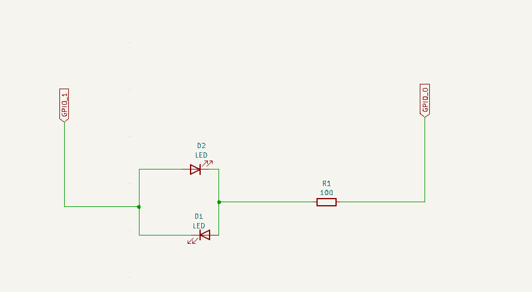
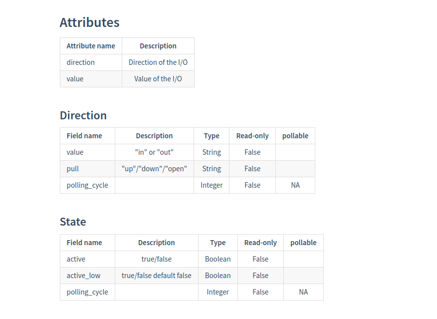
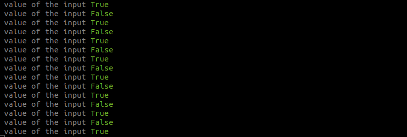

# Digital I/O Control with Raspberry Pico

This tutorial explains, step by step, how to configure a Raspberry Pico and use Panduza to perform simple DIO control.


## Hardware Requirements

For this project, you will need to have the following components : 

- 1 raspberry PI PICO
- 1 USB cable to connect the PC to the PICO (micro USB cable)
- 2 LEDs
- 1 resistor of 1Kohms maximum
- 1 push button

You can use the following schematic to connect the push button to the PICO. It will be helpful to reset the pico board.


You can refer to the pinout below to see where is the RUN PIN on the PICO.

In this example, we will control two digital inputs and outputs, GPIO 0 and GPIO 1. There will be connected.

The GPIO 0 will be set as the output and the GPIO 1 as the input.

To do this, you can do the schematic the following schematic to control one IO: 

`!!! OK POINT FIX DOC AFTER ONLY !!!`

```
!!!!! A CORRIGER
LE SCHEMA NES PAS BON
le schéma est corrigé
```



```
!!!!! A CORRIGER

'If the output' => je ne comprends pas, il y a 2 GPIOs qui peuvent être inpout ou output mais il n'y a pas 1 output...

ensuite tu parles que de la led D1... et l'autre ?

cette erreur de texte vient peut être du fait que le schéma ne soit pas bon
```

If the GPIO_O is set to one, GPIO_1 should be set to one also.

To control various I:O's, you can reproduce the schematic. The resistor value is 100 ohms.

The push button will allow you to reset the PICO without unplugging the cable.

There is a complete schematic with the pinout of the PICO


## Software Requirements

This tutorial has been tested on Ubuntu 20.04 virtual machine.

Update your Ubuntu environment first

```bash 
  sudo apt-get update
  sudo apt-get upgrade
```

Make sure you have installed the following packages : 

```bash
  sudo apt-get install python3-pip # will install pip3 package
  sudo pip install robotframework  # install robot framework package
  sudo apt install git # install git package
  pip install -e "git+https://github.com/Panduza/panduza-py.git@main#egg=panduza&subdirectory=client" # will install python client of panduza
```

Python is already installed on Ubuntu distribution, you won't have to reinstall it.

You will also have to install docker, it's a bit harder to install. You can follow the steps below to guide you.

## installation of docker
You will have to install docker. Docker is a powerful tool that will contain all the application project. 

We will install docker using the apt repository

first update the apt package and do the following command 

```bash
  sudo apt-get update
  sudo apt-get install ca-certificates curl gnupg
```

Add docker's official GPG key : 

```bash
  sudo install -m 0755 -d /etc/apt/keyrings
  curl -fsSL https://download.docker.com/linux/ubuntu/gpg | sudo gpg --dearmor -o /etc/apt/keyrings/docker.gpg
  sudo chmod a+r /etc/apt/keyrings/docker.gpg
```

Then excecute the following command to set up the repository : 

```bash
echo \
  "deb [arch="$(dpkg --print-architecture)" signed-by=/etc/apt/keyrings/docker.gpg] https://download.docker.com/linux/ubuntu \
  "$(. /etc/os-release && echo "$VERSION_CODENAME")" stable" | \
  sudo tee /etc/apt/sources.list.d/docker.list > /dev/null
```

Then, do an update of the apt package : 

```bash
 sudo apt-get update
```

Now the environment is ready to install the docker engine.
Use the following command : 

```bash
 sudo apt-get install docker-ce docker-ce-cli containerd.io docker-buildx-plugin docker-compose-plugin
```

If you wish have more info about how to install docker, I recommend you to check the following site : 

```bash
 https://docs.docker.com/engine/install/ubuntu/
```

**You might have permission issues if you try to build a docker image**. To not have this problem, I recommend you run the following commands : 

```bash
  sudo groupadd docker
  sudo usermod -aG docker $USER
  newgrp docker
```


You might have to reboot your Linux system : 

```bash
  sudo reboot
```

Once the system has rebooted, you can run a docker image to see if it works.

```bash
 docker run hello-wold
```

You should have the following output


As mentioned in the beginning, Panduza is the combination of different blocs, the client, the platform, the MQTT broker and the configuration of the Raspberry PI PICO. We will explain each part of the chain.

## Configuration of the Raspberry PI PICO

The configuration of the PICO is an important step of the project.

First of all, you need to program the PICO with the firmware: [**pza-pico-modbus-dio.uf2**](https://github.com/Panduza/panduza-adapters-sdk/releases/tag/v0.0.2)

To program the PICO, you have to ensure that the PICO is connected to the PC and is in the mode USB Mass Storage Device mode.

This mode indicates that the microcontroller is ready to be programmed.

To check that you are in USB mass storage Device Mode, you can open a terminal and run the following command : 

To go back to USB mass storage mode, you will have to press the push button and the bootsel button on the PICO as showed previousely.

```
!!!!! A CORRIGER
il faut aussi dire aux gens sur quel boutton appuyer... sinon ils vont pas savoir et les bouttons que tu as mis au début ne servenet pas
```


```bash
  lsusb
```

This command will list all the USB devices connected to the PC.


**Raspberry Pi RP2 Boot** show's that the PICO is in USB mass storage mode.

To flash the PICO, you will have to copy a binary file with the .uf2 extension.

A .uf2 extension is a binary file that will allow you to program an MCU over the USB port. Since the PICO is connected threw USB, you will have to flash a .uf2 file.

In our case you will have to copy the **pza-pico-modbus-dio.uf2** to the PICO using the following command : 

```bash
  cp pza-pico-modbus-dio.uf2 /media/<user_name>/RP2_RPI
```

After this, the USB mode is disabled.

The name of the pico when programmed is **panduza.io dio-modbus**, his vendor id is **16c0** and id product **05e1**

You can use usb-devices command to check if a USB device with the vendor, product and name is available.


```
!!!!! A CORRIGER
Dans ta capture d'écran on voit pas panduza.io... ?
En effet, mais toutefois, il y'a bien le bon vendor id et product id
```


**Make sure you have a usb manufacture name panduza.io, with the vendor id is 16c0 and product id is 05e1**

A serial port should be opened in the /dev directory of your Linux environment. The serial port name should be **ttyACM0** or **ttyACM1**.

If you want to make sure that the ports exist, you can list all the serial ports of the /dev directory.


```bash
  cd /dev
  ls devttyACM*
```

To reset the MCU, you need to press the push button and the bootsel button of the MCU. This will erase the software from the flash and after a couple of seconds, the PICO will be back in USB mass storage mode.


# Panduza client

The PICO client is the Panduza bloc from the point of view of the user.

This part will allow you to send various information about each I:O (GPIO 0 in our case) to the PICO via the MQTT broker.

To do this, we first have to understand the different attributs and filds of a IO.

<p> It's direction. "in" or "out" </p>
<p> the pull value. It's the configuration of a input. it's ether "up", "down" or "open"</p>
<p> It's active state. True or False. </p>
<p> active_low. True or False. by default it is set to false. </p>



Also, we can configure a polling cycle. The polling cycle is the time between two acquisitions. This time is measured in seconds.

In our example, we want to control the input GPIO_1 witch is wired with the GPIO_0 output.

To do this we will set the output to the value True, and the INPUT should be passing to True.

But first, we have to do various configurations;

**Configure the server**

```python
BROKER_ADDR="localhost"
BROKER_PORT=1883
```

**Configure the Topics**

A topic corresponds to a path where will be stored all the data from each I:O.

We will configure, one topic per IO.


```python
  pzaTOPIC=f"pza/lab_paul/io_pza_controling/testing_of_io_controling{0}"
  pzaTOPIC1=f"pza/lab_paul/io_pza_controling/testing_of_io_controling{1}"
```

**do a first connexion test**

```python
  pzaClient = Client(url=BROKER_ADDR, port=1883)
  pzaClient.connect()
```

**Scanning the interfaces**

This will make sure that all the topics have been created. There is an example of a message you must see in the output of your terminal


```python
  # scan the interface
  inter = pzaClient.scan_interfaces()

  # list all the topics
  print("scanning the interfaces..")
  for topic in inter:
      print(f"- {topic} => {inter[topic]['type']}")
```

On the output of the terminal, you need to see all the declared topics.


create instances of Dio. This will allow you to the user to use the function of the drivers

```python
# declare instances of dio. One per io control
d = Dio(addr=BROKER_ADDR, port=BROKER_PORT, topic=pzaTOPIC, client=pzaClient)
d1 = Dio(addr=BROKER_ADDR, port=BROKER_PORT, topic=pzaTOPIC1, client=pzaClient)
```

**Then we can start sending data to the output**

```python
while True:
    d.direction.value.set("out")
    time.sleep(1)
    d.direction.pull.set("up")
    time.sleep(1)
    d.direction.polling_cycle.set(1)
    time.sleep(1)

    d.state.active_low.set(False)
    time.sleep(1)
    d.state.active.set(True)
    time.sleep(1)
    print(d1.state.active.get())
    time.sleep(2)
    d.state.active.set(False)
    time.sleep(1)
    d.state.polling_cycle.set(1)
    time.sleep(1)

```

To set the output to one, we have to send True in the state active field.

To check if the input, is passed to True, we have to use the get() function, which will allow you read the value of the state active

```python
  print(d1.state.active.get())
```

You should have the following result in the terminal



To understand more about how the client works, there is an example of the architecture of how it works.


The script of the client is available in the following repository : 

## launch of Panduza client

To launch the script clone the repo using the following command : 

```bash
git clone https://github.com/MageTomcat14/pza_client_dio.git
```

Run the script by using the following command : 

```bash
  python3 client.py
```


Note that the platform must run before launching the script. Otherwise, you can have a connection error : 


# Panduza platform

The Panduza platform consists of getting the data from the broker MQTT and sending data to control the I:O's of the MCU.

Like the Panduza client, the platform has its architecture.


The platform has three main blocks.

<p>The MetaDriver will manage the communication with the MQTT broker, by reading and setting values to the MQTT broker.</p>
<p>The Driver class, which is heritated from Metadriver, will implement the functions that we have created in the MeteDriver class.</p>
<p>The connector, will contain the functions to transfer or read data from the MCU</p>.

Therefore, we have created a MetaDriver and Driver class to implement dio controls.

The driver will call the connector functions. The functions of the connector are related to the protocol used.
In our case, we will use the Modbus functions from the Pymodbus library.

The Panduza platform is available in the following repository.

```bash
  git clone https://github.com/Panduza/panduza-py.git
```

Before running our platform, the image needs to be built.

To do this, you have to execute the following command :

```bash
  ./platform/docker.build-local.sh
```
This command will configure your project environment. It will create a local image that you will run when the platform is launched.

Then you will have to configure your platform : 

## Configuration of platform

To launch the platform, you need to create a workspace and put the following elements :

**<p>One tree.json file. **This JSON file will** configure the interface you want to control and the brokers you are going to use.</p>**
**One docker-compose.yml will deploy docker application.</p>**

You can put the following JSON and docker-compose.yml


```json
{
    "machine": "lab_paul",
    "brokers": {
        "I/O driver": {
            "addr": "localhost",
            "port": 1883,
            "interfaces": [
                {
                    "name" : "testing_of_io_controling%r",
                    "driver" : "io_pza_controling",
                    "repeated":[0,1,2,3,4,5,6,7,8,9,10,11,12,13,14,15,16,17,18,19,20,21,22,26,27,28],
                    "settings":
                    {
                        "usb_serial_id" : "E6614C311B888B35",
                        "gpio_id" : "%r"
                    }
                }
            ]
        }
    }
}

```
The repeated attribute will allow you to declare various instances of the dio driver. In the tree.json you will put specific information about the pico and how many I:O's you want to control. Therefore, this JSON file can be modified.


**One driver will control one GPIO**

Therefore, the tree.json will instance one driver for each GPIO.

```yml
version: '3'
services:
  # docker compose run --service-ports mosquitto
  mosquitto:
    image: eclipse-mosquitto
    ports:
      - 1883:1883
      - 9001:9001
    volumes:
      - ./data/mosquitto.conf:/mosquitto/config/mosquitto.conf
  panduza-py-platform:
    # image: ghcr.io/panduza/panduza-py-platform:latest
    # To use your local platform build
    image: local/panduza-py-platform
    privileged: true
    depends_on: 
      - mosquitto
    network_mode: host
    volumes:
      - .:/etc/panduza
      - /run/udev:/run/udev:ro
    # command: bash
```

Make sure that you use the local image that has been built as described above.

## RUN panduza platform

To run the Panduza platform, you have to put yourself in the directory containing the tree.json and the docker-compose.yml.

Then execute the following command : 

```bash
  docker compose up
```

This command will do the following tasks,

Execute the mosquitto server

List all of the available drivers

Show the tree.json configuration

Start the interfaces for each I:O

Do the first update of the MQTT broker

You must have the following result : 


The docker compose will do a first init of the MQTT broker.


# RUN PANDUZA

To run correctly the project, you need to respect the following order

**<p>Program the PICO</p>**
**<p>launch the platform</p>**
**<p>run the client script</p>**


# Additional requirements

If you wish do some debugging or understand more the communication process.
You can install the MQTT-explorer software. This will allow you to have a visual comprehension of the communication between Panduza and the MQTT broker.

To install the MQTT broker, you need to use the following commands :

```bash
  sudo snap install mqtt-explorer # installation of MQTT explorer
```

To launch MQTT, you can either search the application in the Ubuntu environment or use the following command line :

```bash
  mqtt-explorer
```

You can also install the minicom package to view data threw a serial port. This can be used for debugging purposes

```bash
  sudo apt install minicom
  sudo minicom -D /dev/ttyACM0 -b 115200 # see serial port data
```